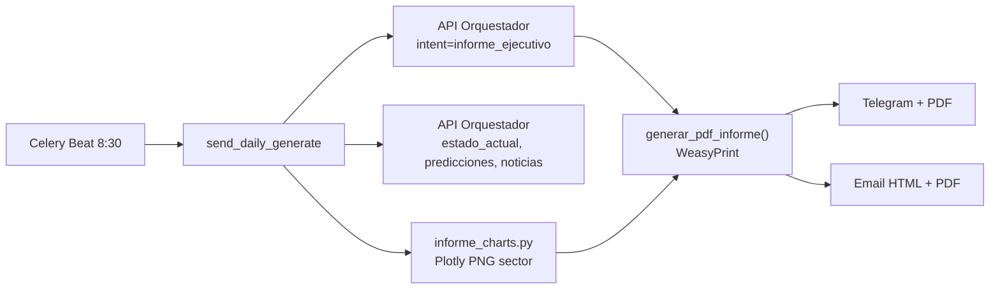

# Informe Ejecutivo MME — Contenido y fuentes de datos

Documentación de auditoría del informe diario automatizado: qué muestra cada sección,
de dónde provienen los datos y cómo se distribuyen entre PDF, email y Telegram.

**Generador principal:** `tasks/anomaly_tasks.send_daily_generate` (Celery Beat 8:30 AM COT)

**Artefactos persistidos:** `whatsapp_bot/informes/Informe_Ejecutivo_MME_{YYYY-MM-DD}.pdf` y `.html`

---

## Flujo general de generación



| Artefacto | Archivo generador | Destino |
|-----------|-------------------|---------|
| PDF | `domain/services/report_service.generar_pdf_informe()` | Telegram, email adjunto, `whatsapp_bot/informes/` |
| Email HTML | `domain/services/notification_service.build_daily_email_html()` | Cuerpo del correo (sin narrativa IA completa) |
| Texto Telegram | Construido en `tasks/anomaly_tasks.py` | Mensaje compacto + PDF adjunto |

---

## Estructura del PDF

`generar_pdf_informe()` ensambla **6 bloques fijos** (sector eléctrico + cierre):

| Orden | Sección | Builder | Páginas aprox. |
|-------|---------|---------|----------------|
| 1 | Mercado / Resumen ejecutivo | `_build_page_mercado` | 1 |
| 2 | Generación por fuente | `_build_page_generacion` | 1–2 |
| 3 | Hidrología y embalses | `_build_page_hidrologia` | 3–4 |
| 4 | Análisis ejecutivo IA | `_build_page_analisis` | 1+ |
| 5 | Gestión de riesgos | `build_chapter_gestion_riesgos` | 1 |
| 6 | Noticias + canales | `build_chapter_noticias` | 1 |

Los capítulos de dashboards del portal (comunidades, OR, FENOGÉ, solar, subsidios, supervisión, presupuesto) **están suspendidos** del informe diario. Ver [`INFORME_PORTAL_CAPITULOS_PENDIENTES.md`](INFORME_PORTAL_CAPITULOS_PENDIENTES.md).

---

## Capítulo 1 — Sector eléctrico

### Página 1 — Mercado / Resumen ejecutivo

**Builder:** `_build_page_mercado` (`domain/services/report_service.py`)

| Bloque | Contenido | Fuente de datos |
|--------|-----------|-----------------|
| Resumen ejecutivo (3 fichas horizontales) | Generación, Precio bolsa, Embalses con variación % | `fichas` ← orquestador `estado_actual`; `tabla_indicadores_clave`, `analisis_multidimensional` ← `informe_handler.py` |
| Variables del Mercado | Gráfica PPP + panel de variables (demanda, exportaciones, etc.) | `variables_mercado`, `chart_paths`; gráficos en `whatsapp_bot/services/informe_charts.py` sobre tabla **`metrics`** (XM vía ETL) |
| Composición de la Demanda | Gráfica de demanda por sector | `variables_mercado` + chart `demanda` |
| Predicción Precio de Bolsa | Tarjeta proyección 1 mes | `pred_resumen` ← `_build_predicciones_mes_resumen`; modelos en **`predictions`** / orquestador `predicciones` |

### Página 2 — Generación real por fuente

**Builder:** `_build_page_generacion`

| Bloque | Contenido | Fuente |
|--------|-----------|--------|
| Ficha KPI generación total | Valor GWh, tendencia, variación vs 7d, semáforo | `fichas` ← `estado_actual` |
| Pie chart + tabla por fuente | Hidráulica, Térmica, Solar, Eólica, Biomasa (GWh y %) | `gen_por_fuente` ← `_build_generacion_por_fuente()` (**`metrics`**, métrica `Gene`); chart `generacion` |
| Bloques narrativos por fuente | Descripción e implicación por tipo | Derivado de `gen_por_fuente.fuentes` (texto plantilla) |
| Despacho vs Gen. Térmica | Gráfica + predicción generación 1 mes | Chart `despacho_termica`; `pred_resumen` métrica GENE_TOTAL |

### Páginas 3–6 — Hidrología y embalses

**Builder:** `_build_page_hidrologia` (puede emitir varias `<div class="page">`)

| Bloque | Contenido | Fuente |
|--------|-----------|--------|
| Ficha embalses % | Nivel agregado SIN, tendencia, semáforo NE (CREG 209/2020) | `fichas` + `embalses_detalle` ← `_build_embalses_detalle()` |
| Capacidad embalse + Aportes vs Demanda | 2 gráficas estilo XM | Charts `capacidad_embalse`, `aportes_demanda` ← **`metrics`** (CapaUtilDiarEner, AporEner, demanda) |
| Evolución volumen útil | Líneas históricas 3 series | Chart `aportes_hidricos` |
| Panel reserva nacional | % actual, media histórica 2020–2025, desviación, energía GWh | `embalses_detalle` |
| Detalle por embalse | Tabla embalse a embalse | `_build_hidrologia_detalle_table()` ← **`metrics`** |
| Mapa regional + aportes por río | Mapa % por región + tabla ríos | Chart `embalses` (mapa); `_get_aportes_rios_table()` ← BD |
| Nivel por región hidrológica | Tabla regiones con semáforo | `embalses_regionales` ← `_build_embalses_regionales()` |
| Proyecciones hidrología | Tabla métricas 1 mes (embalses, aportes) | `pred_resumen.metricas` ← **`predictions`** |

### Análisis ejecutivo (IA)

**Builder:** `_build_page_analisis`

| Contenido | Fuente |
|-----------|--------|
| Narrativa Markdown → HTML (~5 secciones: situación actual, tendencias/proyecciones, riesgos, recomendaciones) | `informe_texto` vía **Groq/OpenRouter** en `informe_handler._generar_informe_con_ia()`, alimentado con JSON `contexto` (fichas, predicciones 1s/1m/6m/1a, anomalías, noticias, umbrales CREG) |
| Fallback si IA falla | `_generar_informe_fallback()` — tablas numéricas sin narrativa |

**Solo en PDF.** El email HTML no incluye esta narrativa (ver `build_daily_email_html`).

### Gestión de riesgos (después del análisis IA)

**Builder:** `build_chapter_gestion_riesgos` → `_build_page_noticias` sin noticias

| Contenido | Fuente |
|-----------|--------|
| Índices compuestos ISH, IPM, IES, CIS (0–100 + nivel + texto explicativo) | `indices_compuestos` ← `_build_indices_compuestos()` |
| Anomalías detectadas (top 5) | `anomalias` ← orquestador `anomalias_detectadas` o fallback **`alertas_historial`** |

### Noticias (última página)

**Builder:** `build_chapter_noticias`

| Contenido | Fuente |
|-----------|--------|
| 3 titulares con resumen, fuente y enlace | Orquestador `noticias_sector` + RSS |
| Canales Telegram y Portal | Estático |

---

## Gráficos del sector (9 PNG)

`whatsapp_bot/services/informe_charts.generate_all_informe_charts()`:

| Clave | Métrica BD | Tabla |
|-------|-----------|-------|
| `generacion` | Gene por recurso | `metrics` + `catalogos` |
| `embalses` | CapaUtil por embalse | `metrics` |
| `precios` | PrecBolsNaci 90d | `metrics` |
| `demanda` | Demanda por sector | `metrics` |
| `precio_multi` | Precio multi-serie | `metrics` |
| `aportes_hidricos` | Aportes hídricos | `metrics` |
| `despacho_termica` | Despacho vs térmica | `metrics` |
| `capacidad_embalse` | Capacidad 120d | `metrics` |
| `aportes_demanda` | Aportes vs demanda | `metrics` |

Datos `metrics`: ETL incremental XM (`tasks.etl_tasks.etl_incremental_all_metrics`, cada 6h).

---

## Email HTML

`domain/services/notification_service.build_daily_email_html()`:

| Sección | Datos | Fuente |
|---------|-------|--------|
| 3 KPI cards | Generación, Precio, Embalses + variación | `fichas` |
| Proyecciones 1 mes | Indicador/valor/cambio/tendencia + MAPE | `predicciones` (enriquecidas en `anomaly_tasks`) |
| Riesgos y anomalías | Top 5 con severidad | `anomalias` |
| Índices ISH/IPM/IES/CIS | Tarjetas con explicación por nivel | `indices_compuestos` |
| Noticias | 3 titulares | `noticias` ← orquestador |
| Canales + aviso PDF | Links Telegram y Portal | Estático |

No incluye narrativa IA (solo en PDF adjunto).

---

## Telegram (resumen compacto)

Construido en `send_daily_generate` (texto plano, sin Markdown):

- KPIs (3 fichas principales)
- Proyecciones próximo mes (compacto)
- Anomalías (top 5; campo `indicador` del orquestador)
- Titulares noticias (3)
- PDF adjunto

**CU y PNT excluidos** del informe diario (PDF, email y Telegram). El contexto interno `cu_pnt` sigue calculándose en el orquestador para otros usos, pero no se renderiza en ningún canal del informe.

---

## Índices compuestos (ISH, IPM, IES, CIS)

Calculados en `informe_handler._build_indices_compuestos()`. Renderizados en PDF y email vía módulo compartido `domain/services/indices_compuestos_meta.py` (sigla + nombre completo + subtítulo en cada tarjeta).

### Glosario

| Sigla | Nombre completo | Subtítulo en ficha |
|-------|-----------------|-------------------|
| **ISH** | Índice de Sostenibilidad Hídrica | Disponibilidad hídrica en embalses |
| **IPM** | Índice de Presión de Mercado | Presión alcista de precios de bolsa |
| **IES** | Índice de Estrés del Sistema | Estrés operativo agregado |
| **CIS** | Calificación Integral del Sistema | Estado general del SIN |

**Escala (nota al pie del PDF/email):** ISH y CIS — mayor valor = mejor condición. IPM e IES — mayor valor = mayor presión/estrés.

| Índice | Fuente principal |
|--------|------------------|
| ISH | % embalses desde ficha `estado_actual` (campo `indicador`) |
| IPM | Precio vs `contexto.promedio_7_dias` de la ficha de precio; ajuste por anomalías de precio |
| IES | Combinación ponderada ISH + IPM + factor anomalías |
| CIS | Síntesis ISH, IPM e IES |

**Trazabilidad ISH** (campo `indices_compuestos.componentes`):

| Campo | Descripción |
|-------|-------------|
| `ish_embalse_pct` | % leído de la ficha de embalses (null si no hay ficha) |
| `ish_fuente` | `ficha_embalse` o `fallback_50` |
| `fecha_dato_embalse` | Fecha de la ficha de embalses |

Si no se encuentra ficha de embalse, el handler registra `WARNING` en logs y usa ISH=50 (base neutral).

**Corrección jun 2026:** búsqueda de fichas por `indicador` (no `metrica`, que viene vacío en `estado_actual`). Baseline IPM usa `promedio_7_dias` del contexto de la ficha.

**Reload API tras cambios en cálculo:** después de modificar `informe_handler.py` (o cualquier lógica de índices en workers gunicorn), recargar la API antes de regenerar el informe:

```bash
kill -HUP $(pgrep -f "gunicorn api.main:app" | head -1)
```

Sin reload, un PDF regenerado puede seguir mostrando valores stale (p. ej. ISH=50) aunque el código en disco ya esté corregido.

---

## Origen consolidado por capa

| Capa | Rol |
|------|------|
| Orquestador FastAPI (`/v1/chatbot/orchestrator`) | Estado, predicciones multi-horizonte, anomalías, noticias, contexto enriquecido, informe IA |
| PostgreSQL `metrics` | Series XM: generación, precios, embalses, aportes, demanda |
| PostgreSQL `predictions` | Modelos ML (GENE_TOTAL, PRECIO_BOLSA, EMBALSES_PCT) + quality history MAPE |
| Groq/OpenRouter | Redacción narrativa sección IA del PDF |
| Plotly | 9 gráficos sector → PNG embebidos en PDF |

Los esquemas portal (`comunidades`, `subsidios`, etc.) ya no alimentan el informe ejecutivo diario; quedan documentados en [`INFORME_PORTAL_CAPITULOS_PENDIENTES.md`](INFORME_PORTAL_CAPITULOS_PENDIENTES.md).

---

## Notas operativas

- El PDF diario incluye ~9 gráficos sector (no ~43); tamaño esperado notablemente menor que la versión multi-capítulo portal.
- `informe_ejecutivo` usa timeout 180s con un reintento; sin `contexto_datos` la tarea aborta **sin marcar lock** (re-ejecución manual permitida).
- Si falta solo el texto IA, `informe_texto` usa fallback KPI (`_build_kpi_fallback`) pero el PDF conserva contexto enriquecido y gráficos.
- Emails: fanout paralelo vía `send_daily_emails_fanout` + `send_single_daily_email` (SMTP timeout 30s).
- Reintento de emails sin regenerar PDF: ver sección 3.9 en `RUNBOOK_PRODUCCION.md`.
- Endpoint de descarga del último PDF: `GET /v1/reports/daily-pdf` (requiere `X-API-Key`).

---

*Última actualización: junio 2026 — sector + riesgos + noticias; CU/PNT excluidos; fix índices IPM/ISH; etiquetas sigla+nombre completo; trazabilidad ISH.*
